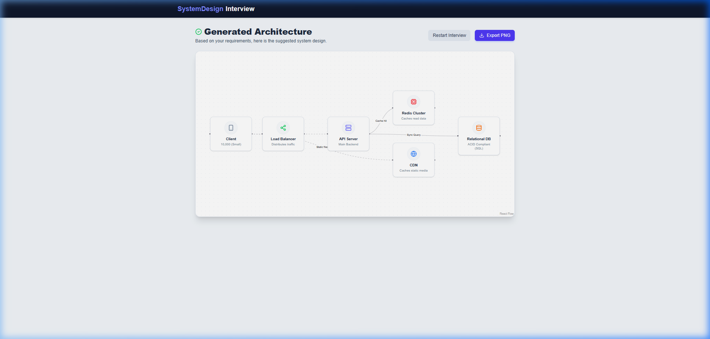
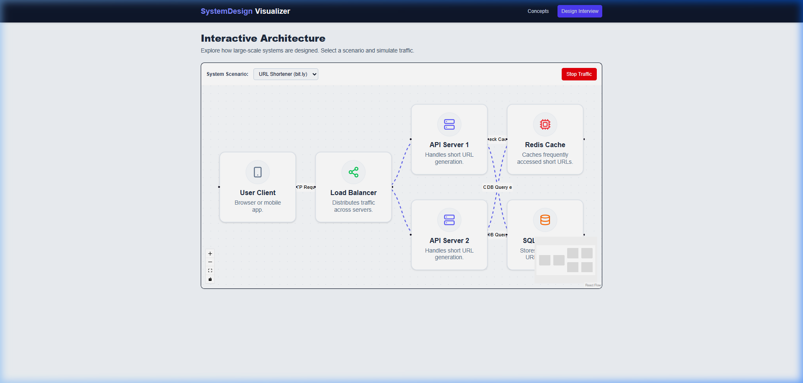

# 🏛️ System Design Visualizer

An interactive and beautifully crafted educational tool to learn, visualize, and practice **System Design** and large-scale architectural patterns. This is the logical next step after the SDLC Visualizer, tailored for Software Engineers and FAANG interview preparation.

<!-- <div align="center">
  
</div> -->

## ✨ Highlights

- 🧠 **Design Interview Mode**: An interactive step-by-step wizard that asks you system requirements (DAU, Read/Write Ratio, Consistency needs) and auto-generates the ideal architecture.
  
  
  
- 🚦 **Traffic Simulation**: Watch data flow through your load balancers, caching layers, and databases with animated edges and React Flow.
  
  
   
- 📚 **Concept Explorer**: Deep dive into core concepts like *Horizontal vs Vertical Scaling*, *Load Balancing Algorithms*, and *Caching Strategies* with interactive side-by-side diagrams and code snippets.
- 📸 **1-Click Export**: Export any generated architecture diagram to a high-quality PNG for your notes or presentations.

## 🚀 Tech Stack
- React 18 + Vite + TypeScript 
- React Flow (for Architecture Canvas)
- Framer Motion (for Node Animations)
- Tailwind CSS v4
- Zustand
- Lucide React

## 📦 Getting Started

```bash
# Clone the repository
git clone <your-repo-url>
cd system-design-visualizer

# Install dependencies
npm install

# Start development server
npm run dev
```

Open `http://localhost:5173` (or the port specified by Vite) to view it in the browser.
